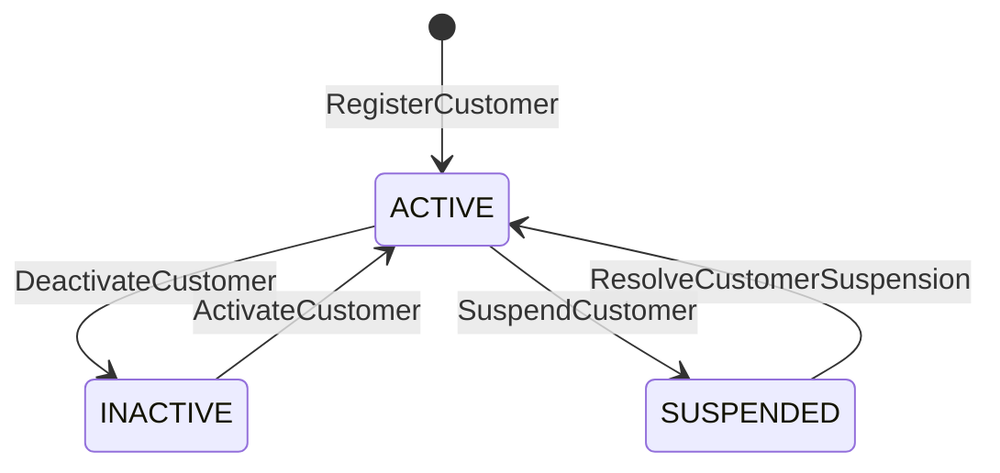
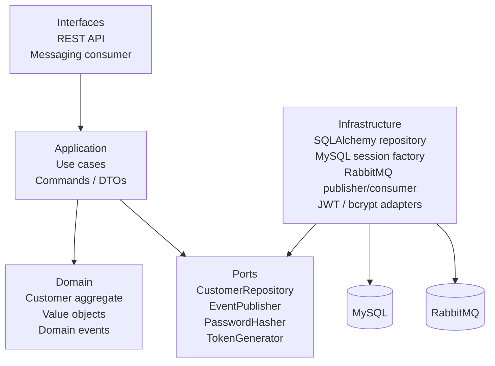

# Customer Service

## Propósito

Gestionar clientes y su estado dentro del sistema. En el MVP actual, este servicio también resuelve la autenticación básica del usuario, por lo que `Customer` representa tanto al cliente del negocio como al usuario autenticable del sistema.

> Rol de este documento: referencia operativa del servicio. Si buscás contexto breve, empezá por `docs/service-overview.md`. Si buscás el modelo del dominio, seguí con `docs/ddd/customer-context.md`.

## Alcance del MVP

Además del modelo del dominio definido en el DDD, este servicio incorpora decisiones técnicas para poder operar como MVP funcional:

- registro con email y contraseña
- login con JWT de corta duración
- roles básicos: `customer` y `admin`
- validación de elegibilidad para reserva

Estas decisiones responden a necesidades del MVP y no implican necesariamente la forma final del dominio a largo plazo.

## Límites del servicio

### Este servicio sí hace

- registrar clientes
- autenticar clientes
- mantener estado y datos del cliente
- validar si un cliente puede reservar
- publicar eventos del ciclo de vida del cliente

### Este servicio no hace

- gestionar reservas
- procesar pagos
- decidir reglas internas de Booking
- implementar refresh tokens o revocación compleja

## Responsabilidades

- registrar clientes con email y contraseña
- autenticar clientes mediante login
- emitir JWT de corta duración
- mantener el estado del cliente
- actualizar datos del cliente
- activar clientes inactivos
- suspender clientes activos
- resolver suspensiones de clientes
- exponer consulta de elegibilidad para reserva
- publicar eventos relevantes del ciclo de vida del cliente

## Casos de uso

### Públicos para otros servicios

- `GetCustomerById`
- `ValidateCustomerForReservation`
- `CustomerValidationConsumer` (flujo asíncrono disparado por `BookingCreated`)

### Públicos para autenticación

- `RegisterCustomer`
- `AuthenticateCustomer`

### Administrativos

- `UpdateCustomer`
- `DeactivateCustomer`
- `ActivateCustomer`
- `SuspendCustomer`
- `ResolveCustomerSuspension`
- `ListCustomers`

## Cómo leer esta documentación

- `docs/service-overview.md` explica el propósito y los límites sin entrar en detalle operativo.
- Este archivo documenta el runtime real del microservicio: endpoints, eventos, adaptadores, diagramas y bootstrap local.
- `docs/ddd/customer-context.md` describe el aggregate `Customer`, invariantes y eventos del dominio vigentes en el MVP.

## Endpoints

### Resumen rápido

| Método | Ruta | Tipo | Auth |
| --- | --- | --- | --- |
| `POST` | `/auth/register` | Público | No |
| `POST` | `/auth/login` | Público | No |
| `GET` | `/customers/{customerId}` | Consulta | No |
| `GET` | `/customers/{customerId}/reservation-eligibility` | Integración interna | No |
| `PATCH` | `/customers/{customerId}` | Administrativo | Bearer admin |
| `PATCH` | `/customers/{customerId}/deactivate` | Administrativo | Bearer admin |
| `PATCH` | `/customers/{customerId}/activate` | Administrativo | Bearer admin |
| `PATCH` | `/customers/{customerId}/suspend` | Administrativo | Bearer admin |
| `PATCH` | `/customers/{customerId}/resolve-suspension` | Administrativo | Bearer admin |
| `GET` | `/customers` | Administrativo | Bearer admin |

### Autenticación

#### Registrar cliente

```http
POST /auth/register
```

Body esperado:

```json
{
  "name": "Jane Doe",
  "email": "jane@example.com",
  "phone": "+57-3000000000",
  "password": "plain-password"
}
```

#### Login

```http
POST /auth/login
```

Body esperado:

```json
{
  "email": "jane@example.com",
  "password": "plain-password"
}
```

Respuesta esperada:

```json
{
  "accessToken": "jwt-token",
  "tokenType": "Bearer",
  "expiresIn": 1800,
  "customer": {
    "customerId": "uuid",
    "name": "Jane Doe",
    "email": "jane@example.com",
    "phone": "+57-3000000000",
    "status": "ACTIVE",
    "role": "customer"
  }
}
```

### Consultas

#### Obtener cliente por identificador

```http
GET /customers/{customerId}
```

#### Validar cliente para reserva

```http
GET /customers/{customerId}/reservation-eligibility
```

Respuesta esperada:

```json
{
  "customerId": "uuid",
  "status": "ACTIVE",
  "isEligible": true
}
```

### Administración

Todos los endpoints administrativos requieren autenticación Bearer con rol `admin`.

```http
PATCH /customers/{customerId}
PATCH /customers/{customerId}/deactivate
PATCH /customers/{customerId}/activate
PATCH /customers/{customerId}/suspend
PATCH /customers/{customerId}/resolve-suspension
GET /customers
```

## Errores relevantes

- `401 Unauthorized` — credenciales inválidas, falta token Bearer o token inválido
- `403 Forbidden` — token válido pero sin rol `admin`
- `409 Conflict` — email duplicado o transición de estado inválida
- `404 Not Found` — customer no encontrado
- `503 Service Unavailable` — fallo al publicar un evento de integración
- `500 Internal Server Error` — error inesperado no controlado dentro del runtime HTTP

## Logging

El servicio tiene logging básico con la librería estándar de Python.

En términos generales, cubre:

- intentos y éxitos de `register/login`
- cambios de estado administrativos del cliente
- fallos al publicar eventos hacia RabbitMQ
- errores inesperados capturados por el handler global `500 Internal Server Error`

No loguea contraseñas ni expone secretos deliberadamente.

## Puertos

### Puertos de entrada

- `RegisterCustomerUseCase`
- `AuthenticateCustomerUseCase`
- `GetCustomerByIdUseCase`
- `ValidateCustomerForReservationUseCase`
- `UpdateCustomerUseCase`
- `DeactivateCustomerUseCase`
- `ActivateCustomerUseCase`
- `SuspendCustomerUseCase`
- `ResolveCustomerSuspensionUseCase`
- `ListCustomersUseCase`

### Puertos de salida

- `CustomerRepository`
- `EventPublisher`
- `PasswordHasher`
- `TokenGenerator`

## Adaptadores

### Adaptadores de entrada

- controlador REST para autenticación
- controlador REST para consultas de cliente
- controlador REST para administración de cliente

### Adaptadores de salida

- adaptador de persistencia MySQL
- adaptador de publicación de eventos
- adaptador de hash de contraseña
- adaptador de generación de JWT

## Estados del cliente

- `ACTIVE`
- `INACTIVE`
- `SUSPENDED`

### Diagrama de transiciones



## Reglas de transición

- `DeactivateCustomer` solo aplica desde `ACTIVE`
- `ActivateCustomer` solo aplica desde `INACTIVE`
- `SuspendCustomer` solo aplica desde `ACTIVE`
- `ResolveCustomerSuspension` solo aplica desde `SUSPENDED`
- `INACTIVE` y `SUSPENDED` implican que el cliente no es elegible para reservar

## Eventos que publica

### `CustomerRegistered`

Se publica al registrar un cliente exitosamente.

```json
{
  "customerId": "uuid",
  "name": "Jane Doe",
  "email": "jane@example.com",
  "registeredAt": "timestamp"
}
```

### `CustomerInfoUpdated`

Se publica al actualizar datos del cliente.

```json
{
  "customerId": "uuid",
  "updatedFields": ["name", "phone"]
}
```

### `CustomerDeactivated`

Se publica al desactivar un cliente activo.

```json
{
  "customerId": "uuid",
  "deactivatedAt": "timestamp",
  "reason": "manual"
}
```

### `CustomerActivated`

Se publica al activar un cliente inactivo.

```json
{
  "customerId": "uuid",
  "activatedAt": "timestamp"
}
```

### `CustomerSuspended`

Se publica al suspender un cliente activo.

```json
{
  "customerId": "uuid",
  "suspendedAt": "timestamp",
  "reason": "policy_violation"
}
```

### `CustomerSuspensionResolved`

Se publica al resolver la suspensión de un cliente suspendido.

```json
{
  "customerId": "uuid",
  "resolvedAt": "timestamp"
}
```

### `CustomerValidationResult`

Se publica cuando el worker consume `BookingCreated` y resuelve si el cliente puede reservar.

```json
{
  "eventId": "uuid",
  "eventType": "BookingCreated",
  "bookingId": "uuid",
  "customerId": "uuid",
  "isValid": true,
  "timestamp": "timestamp"
}
```

## Eventos que consume

- `BookingCreated` — dispara la validación asíncrona de elegibilidad y la publicación de `CustomerValidationResult`

## Reglas de negocio relevantes

- el email debe ser único en el sistema
- el nombre y email son obligatorios
- `passwordHash` nunca debe exponerse por la API
- un cliente `INACTIVE` o `SUSPENDED` no puede crear nuevas reservas
- la validación de elegibilidad para reserva debe responder en tiempo real
- no se puede eliminar un cliente con reservas activas; el camino correcto es desactivar o suspender según corresponda

## Integración con Booking

### Relación

- Booking consulta si el cliente está habilitado para reservar
- Booking consulta datos básicos del cliente
- Booking puede publicar `BookingCreated` para validación asíncrona
- Booking reacciona a `CustomerDeactivated`
- Booking puede reaccionar también a `CustomerSuspended` si la política de negocio futura lo requiere

### Contrato interno

La consulta de elegibilidad (`/customers/{customerId}/reservation-eligibility`) forma parte de la integración interna entre servicios.
No depende del JWT del usuario final.

### Comunicación

- **síncrona:** consulta de datos y elegibilidad vía REST
- **asíncrona:** consumo de `BookingCreated` y publicación de eventos mediante RabbitMQ

## Arquitectura y layering



Capas reales del repo:

- `internal/interfaces/rest` y `internal/interfaces/messaging` — entrada HTTP y mensajería
- `internal/application` — casos de uso, comandos y DTOs
- `internal/domain` — aggregate `Customer`, reglas, value objects y eventos
- `internal/infrastructure` — persistencia MySQL, configuración, auth y RabbitMQ

## Observaciones de diseño

- en este MVP, `Customer` unifica perfil de negocio y autenticación por simplicidad
- si el sistema crece, identidad y autenticación pueden separarse a otro contexto o servicio
- la auth del MVP no incluye refresh tokens ni revocación compleja
- los roles básicos del MVP son `customer` y `admin`
- la persistencia runtime usa MySQL con un schema dedicado `customer_service`
- la app HTTP publica eventos mediante RabbitMQ y el worker `consumer.py` procesa `BookingCreated`

## Validación técnica

- tests: `uv run pytest`
- type checking: `uv run pyright`
- formato: `uv run black --check .`
- lint: `uv run ruff check .`
- validación canónica del servicio: desde `services/customer-service/`, ejecutar `./scripts/validate.sh`
- integración real RabbitMQ: `uv run pytest test/integration/test_rabbitmq_event_publisher.py -vv`
  - el test usa Docker + Testcontainers para levantar un broker RabbitMQ real
  - si Docker no está disponible, el test hace `skip` explícito con el motivo para mantener la suite determinística

## Docker local

Para demo y desarrollo local simple, el repo incluye en la raíz:

- `docker-compose.yml` — compose base orientado solo a `customer-service`
- `docker-compose.dev.yml` — overrides con infraestructura local y puertos

Usados juntos levantan:

- `customer-service`
- `mysql`
- `rabbitmq`

### Levantar el stack

Desde la raíz del repo:

```bash
docker compose -f docker-compose.yml -f docker-compose.dev.yml up -d
```

### Bajar el stack

```bash
docker compose -f docker-compose.yml -f docker-compose.dev.yml down
```

Si además querés limpiar el volumen nombrado de RabbitMQ:

```bash
docker compose -f docker-compose.yml -f docker-compose.dev.yml down -v
```

### Bootstrap de schema local

Antes de usar la API contra MySQL, corré las migraciones del servicio:

```bash
uv run alembic upgrade head
```

El schema usa charset `utf8mb4` y collation `utf8mb4_0900_ai_ci`.

### Variables relevantes en compose

- `CUSTOMER_SERVICE_EVENT_PUBLISHER_BACKEND=rabbitmq`
- `MYSQL_HOST=mysql`
- `MYSQL_DATABASE=${MYSQL_DATABASE:-customer_service}`
- `MYSQL_USER=${MYSQL_USER:-customer_app}`
- `MYSQL_PASSWORD=${MYSQL_PASSWORD:-customer_app_local}`
- `MYSQL_LOCAL_PORT=${MYSQL_LOCAL_PORT:-3306}`
- `RABBITMQ_HOST=rabbitmq`
- `RABBITMQ_DEFAULT_USER=${RABBITMQ_DEFAULT_USER:-guest}`
- `RABBITMQ_DEFAULT_PASS=${RABBITMQ_DEFAULT_PASS:-guest}`
- `RABBITMQ_PORT=${RABBITMQ_PORT:-5672}`
- `RABBITMQ_UI_PORT=${RABBITMQ_UI_PORT:-15672}`

`MYSQL_ROOT_PASSWORD` aplica al contenedor MySQL local (infra), no a la lógica runtime del servicio.

Para evitar credenciales en git, usá `.env.local` (no versionado) para tus valores reales.

### Verificación rápida

- API health: `http://localhost:8000/health`
- MySQL: `localhost:${MYSQL_LOCAL_PORT:-3306}` (credenciales tomadas de tus variables locales)
- RabbitMQ management: `http://localhost:${RABBITMQ_UI_PORT:-15672}` (credenciales tomadas de tus variables locales)

### Notas

- esta configuración está pensada para entorno local, demo y desarrollo, no para producción
- la app no arranca MySQL ni RabbitMQ desde el compose base; esos servicios viven en `docker-compose.dev.yml`
