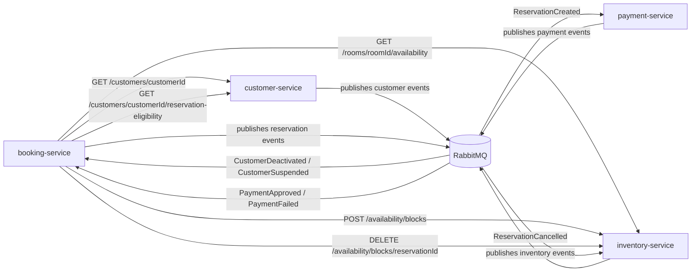
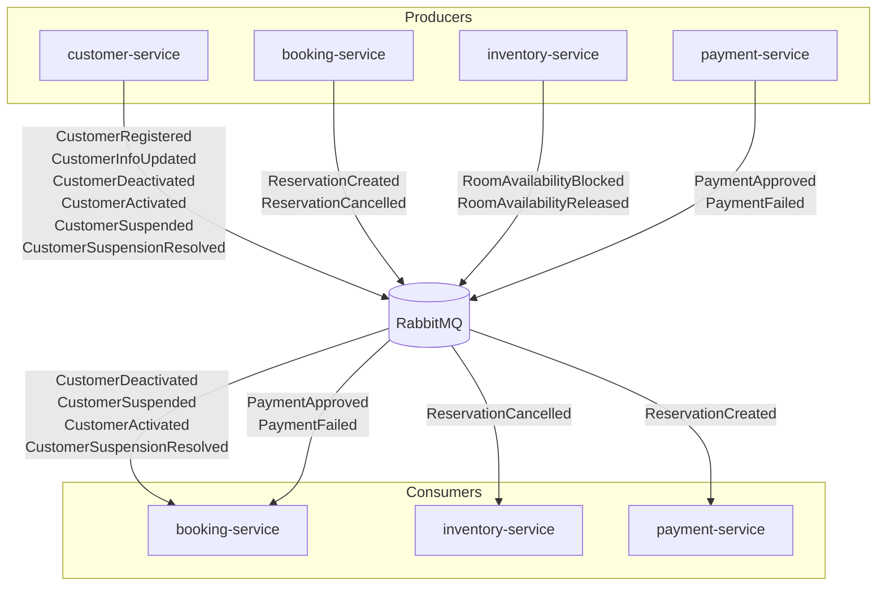

# Integration Map

## Propósito

Este documento resume cómo se relacionan los microservicios entre sí. Debe mantenerse actualizado cada vez que se agregue un servicio nuevo o cambien sus contratos de integración.

## Diagrama general de comunicación

### Vista REST + RabbitMQ



### Vista centrada en eventos



## Criterio de uso

- **REST**: validaciones y consultas que requieren respuesta inmediata.
- **RabbitMQ**: propagación de hechos del dominio para reacciones asíncronas entre servicios.

## Cómo usar este documento

Cada servicio debe documentar:

- si necesita otros servicios o eventos para operar
- qué endpoints expone para otros servicios
- qué eventos publica
- qué endpoints consume de otros servicios
- qué eventos consume de otros servicios

## Plantilla para nuevos servicios

```md
## <service-name>

### ¿Necesita otros servicios o eventos para funcionar?

- Sí / No
- Detalle

### Endpoints que expone para otros servicios

| Método | Ruta | Consumidor esperado | Propósito |
| --- | --- | --- | --- |

### Eventos que publica

| Evento | Consumidor esperado | Propósito |
| --- | --- | --- |

### Endpoints que consume de otros servicios

| Servicio proveedor | Método | Ruta | Propósito |
| --- | --- | --- | --- |

### Eventos que consume de otros servicios

| Evento | Servicio emisor | Propósito |
| --- | --- | --- |
```

---

## customer-service

### ¿Necesita otros servicios o eventos para funcionar?

- **No**, no depende de otros microservicios de negocio para operar.
- `customer-service` usa MySQL con schema dedicado y RabbitMQ como infraestructura propia.
- **Sí** depende de infraestructura propia del entorno:
  - MySQL con schema dedicado `customer_service`
  - RabbitMQ para publicación de eventos

### Endpoints que expone para otros servicios

| Método | Ruta | Consumidor esperado | Propósito |
| --- | --- | --- | --- |
| `GET` | `/customers/{customerId}` | `booking-service` | Obtener datos básicos del cliente |
| `GET` | `/customers/{customerId}/reservation-eligibility` | `booking-service` | Validar si el cliente puede reservar |

### Eventos que publica

| Evento | Consumidor esperado | Propósito |
| --- | --- | --- |
| `CustomerRegistered` | Futuro / opcional | Señalar alta de cliente |
| `CustomerInfoUpdated` | Futuro / opcional | Propagar actualización de datos |
| `CustomerDeactivated` | `booking-service` | Cancelar o bloquear reservas pendientes |
| `CustomerActivated` | `booking-service` (opcional) | Restablecer habilitación del cliente |
| `CustomerSuspended` | `booking-service` | Bloquear operación del cliente |
| `CustomerSuspensionResolved` | `booking-service` (opcional) | Restablecer operación del cliente |

### Endpoints que consume de otros servicios

Por ahora, ninguno.

### Eventos que consume de otros servicios

| Evento | Servicio emisor | Propósito |
| --- | --- | --- |
| `BookingCreated` | `booking-service` | disparar la validación asíncrona del cliente y responder con `CustomerValidationResult` |

---

## inventory-service

### ¿Necesita otros servicios o eventos para funcionar?

Pendiente de definir cuando se implemente.

### Endpoints que expone para otros servicios

Pendiente de definir.

### Eventos que publica

Pendiente de definir.

### Endpoints que consume de otros servicios

Pendiente de definir.

### Eventos que consume de otros servicios

Pendiente de definir.

---

## booking-service

### ¿Necesita otros servicios o eventos para funcionar?

Pendiente de definir cuando se implemente.

### Endpoints que expone para otros servicios

Pendiente de definir.

### Eventos que publica

Pendiente de definir.

### Endpoints que consume de otros servicios

Pendiente de definir.

### Eventos que consume de otros servicios

Pendiente de definir.

---

## payment-service

### ¿Necesita otros servicios o eventos para funcionar?

Pendiente de definir cuando se implemente.

### Endpoints que expone para otros servicios

Pendiente de definir.

### Eventos que publica

Pendiente de definir.

### Endpoints que consume de otros servicios

Pendiente de definir.

### Eventos que consume de otros servicios

Pendiente de definir.
